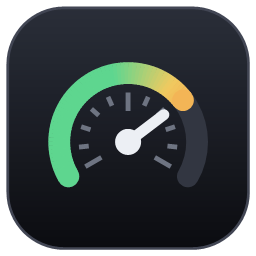
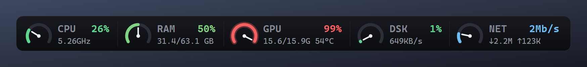
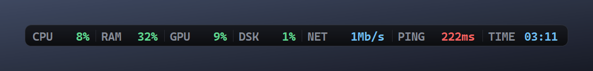
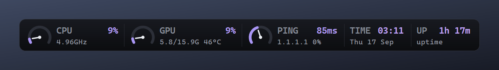
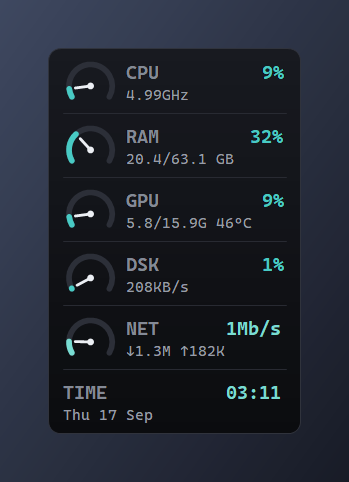
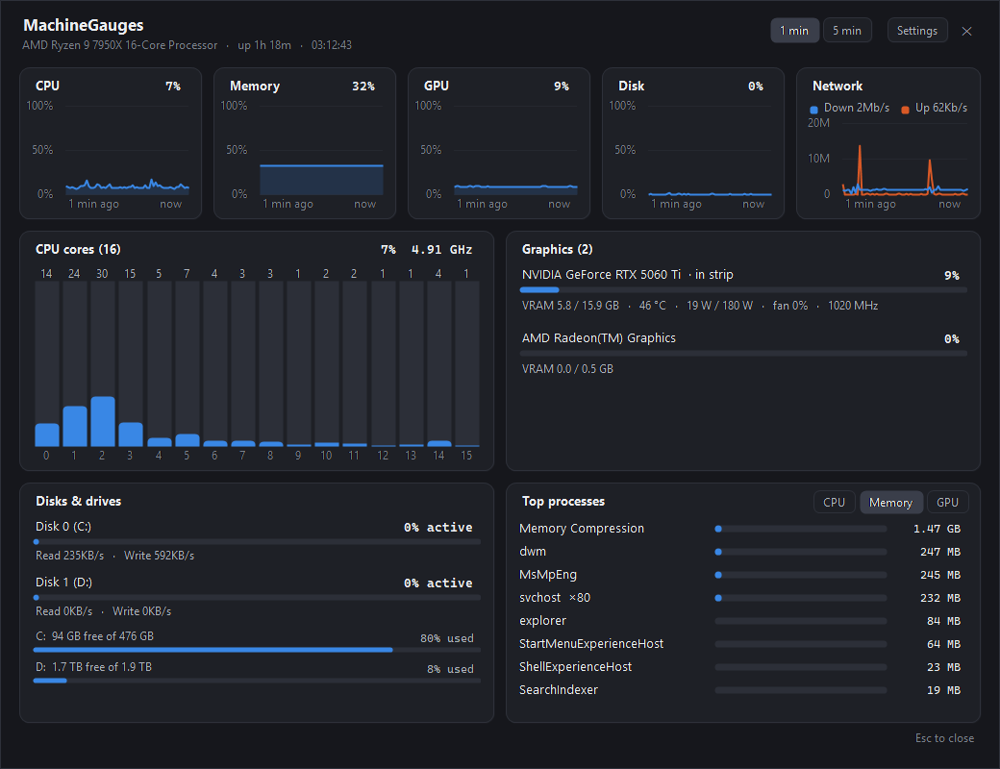

<p align="center">
  
</p>

<h1 align="center">MachineGauges</h1>

<p align="center">
  Live CPU, RAM, GPU, disk and network gauges pinned to the top of your screen,<br>
  showing the same numbers as Windows Task Manager.
</p>

<p align="center">
  <a href="https://github.com/Roy-Mutwiri/MachineGauges/releases/latest"><b>⬇ Download the latest release</b></a>
  &nbsp;·&nbsp; Windows 10 / 11 (64-bit) &nbsp;·&nbsp; free, ~200 KB, no admin rights needed
  <br><br>
  <a href="https://github.com/Roy-Mutwiri/MachineGauges/releases/latest"></a>
  <a href="https://github.com/Roy-Mutwiri/MachineGauges/actions/workflows/build.yml"></a>
</p>



## Install

1. Open the **[latest release](https://github.com/Roy-Mutwiri/MachineGauges/releases/latest)** and download **MachineGauges.exe** under **Assets**.
2. Double-click it and choose **Yes – Install**.
3. The gauges appear at the top centre of your screen and start automatically every time you sign in.

Don't want to install it? Choose **No – Just run it this time** and it runs once from wherever you saved it.

> **"Windows protected your PC"?** The app isn't code-signed yet, so Windows SmartScreen
> warns about new downloads. Click **More info → Run anyway**. Every release is
> [built by GitHub Actions](https://github.com/Roy-Mutwiri/MachineGauges/actions/workflows/build.yml)
> from the source in this repository, and its SHA-256 checksum is listed on the release page.

## The strip

| Gauge | Shows |
|---|---|
| **CPU** | Utilisation and current speed (GHz), plus temperature when [LibreHardwareMonitor](https://github.com/LibreHardwareMonitor/LibreHardwareMonitor) is running |
| **RAM** | Percent used and GB in use / total |
| **GPU** | Utilisation, video memory used / total, and temperature (NVIDIA) |
| **DSK** | Active time of your busiest disk, and throughput |
| **NET** | Throughput of your busiest network adapter, download ↓ and upload ↑ |
| **FPS** | Frames per second of the game in front *(experimental, see below)* |
| **PING** | Latency and packet loss to a host you choose |
| **BAT** | Battery level and time left (laptops) |
| **TIME** / **UP** | Clock, and time since Windows started |

- **Matches Task Manager.** Every figure comes from the same Windows performance counters Task Manager reads.
- **Never in the way.** Clicks pass straight through the strip, and it fades to fully invisible while your mouse is over it.
- **Animated.** Needles glide between readings, colours shift as load rises, and a gauge glows above 90%.
- **Light.** Well under 1% of one CPU core.

Pick which gauges to show and in what order, and choose from gauges or compact text, horizontal or vertical, six screen positions and four colour themes:

<p align="center">
  <br>
  
  
</p>

## Details panel

Press **Ctrl+Shift+G**, left-click the tray icon, or open MachineGauges again while it's running.



- History charts for the last 1 or 5 minutes; hover for exact readings
- Every CPU core, every GPU (usage, video memory, temperature, power, fan, clock speed), every disk and drive
- Top processes by CPU, memory or GPU, the same columns as Task Manager

## Settings

Right-click the tray icon → **Settings**:

| Tab | Options |
|---|---|
| **Appearance** | Gauges or compact text, horizontal or vertical, position, screen, colour theme, size, opacity |
| **Gauges** | Which readings to show and their order; which GPU the strip follows |
| **Behaviour** | Always show, **hide while a full-screen app is in front**, or **only while a game is running**; fade on hover; start with Windows; details shortcut; ping host |
| **Alerts** | Windows notifications for sustained high CPU, memory or GPU usage, high temperatures, and drives running low on space |
| **Advanced** | CSV history log, automatic update checks, FPS counter, CPU temperature source, diagnostic log |

### FPS counter (experimental)

The FPS gauge counts frames for Direct3D 9–12 games using Windows event tracing. Windows only
allows that for administrators and members of the **Performance Log Users** group. Turn it on in
**Settings → Advanced**, click **Grant permission…** (Windows asks for administrator approval
once), then sign out and back in. OpenGL and Vulkan games aren't counted yet.

### CPU temperature

Windows has no reliable built-in CPU temperature reading, and reading the sensors directly needs a
kernel driver. Instead, MachineGauges picks up the temperature from
[LibreHardwareMonitor](https://github.com/LibreHardwareMonitor/LibreHardwareMonitor) whenever that is running.

## Updates

MachineGauges checks GitHub once a day and offers a one-click update. Downloads are only installed
after they match the SHA-256 checksum GitHub publishes for the release. Turn this off in
**Settings → Advanced**, or download the newest `MachineGauges.exe` and double-click it.

## Privacy

MachineGauges runs entirely on your PC. It only connects to the network to:
- check `api.github.com` for new releases (daily, can be turned off), and
- ping the host you choose, only if you add the **Ping** gauge.

Nothing is collected or sent anywhere. The optional history log stays in `%LOCALAPPDATA%\MachineGauges\logs`.

## Uninstall

**Settings → Apps → Installed apps → MachineGauges → Uninstall**, or **Uninstall…** from the tray menu.
This removes the app, its startup entry, Start Menu shortcut and settings.

---

## For developers

<details>
<summary>How the numbers match Task Manager</summary>

All counters are read through PDH (Performance Data Helper) in a single query, using English
counter names so it works on any Windows language.

| Reading | Source |
|---|---|
| CPU % | `\Processor Information(_Total)\% Processor Utility`, the counter Task Manager has used since Windows 10 (not `% Processor Time`) |
| CPU GHz | base clock (`HKLM\HARDWARE\DESCRIPTION\System\CentralProcessor\0\~MHz`) × `% Processor Performance` |
| Per core | `\Processor Information(*)\% Processor Utility` |
| RAM | `GlobalMemoryStatusEx`: total − available |
| GPU % | `\GPU Engine(*)\Utilization Percentage`, summed per engine type; the busiest engine type wins |
| GPUs | DXGI adapter list (names, LUIDs, memory size); NVIDIA NVML for temperature, power, fan and clock |
| VRAM | `\GPU Adapter Memory(*)\Dedicated Usage` |
| Disk % | `100 − \PhysicalDisk(*)\% Idle Time`, busiest disk |
| Network | `\Network Interface(*)\Bytes Total/sec`, busiest adapter, with its received / sent counters |
| Processes | `NtQuerySystemInformation(SystemProcessInformation)`: CPU time and private working set, grouped by name |
| FPS | ETW `Microsoft-Windows-DXGI` and `Microsoft-Windows-D3D9` Present events per process |

</details>

<details>
<summary>Build from source</summary>

No SDK needed. It builds with the C# compiler that ships with Windows (.NET Framework 4.x).

```powershell
.\build.ps1      # renders the icon, then builds build\MachineGauges.exe
.\install.ps1    # installs that build for the current user and starts it
.\uninstall.ps1  # removes it
```

| Path | Purpose |
|---|---|
| `src/Sampler.cs` | Performance counter readings |
| `src/GpuDevices.cs`, `src/ProcessSampler.cs`, `src/Monitors.cs`, `src/FpsMonitor.cs` | GPUs, processes, ping, CPU temperature, FPS |
| `src/OverlayForm.cs` | The strip: layout, animation, visibility, tray menu |
| `src/DetailPanel.cs`, `src/SettingsForm.cs` | Details panel and Settings window |
| `src/Services.cs`, `src/Updater.cs` | History, alerts, CSV log, fullscreen detection, updates |
| `src/Installer.cs` | Self-install, update, startup and uninstall |
| `src/GaugeArt.cs`, `src/IconGen.cs` | Gauge drawing, themes and the app icon |
| `.github/workflows/build.yml` | Builds and smoke-tests every push; publishes a release for every `v*` tag |
| `winget/` | Windows Package Manager manifests |

**Releasing:** bump the version in `src/AssemblyInfo.cs`, add a section to `CHANGELOG.md`, then push a tag:

```bash
git tag v1.4.0
git push origin v1.4.0
```

Command-line options:

```text
MachineGauges.exe                        first run offers to install; if running, opens the details panel
MachineGauges.exe --settings             open Settings
MachineGauges.exe --install [--quiet]
MachineGauges.exe --uninstall [--quiet]
MachineGauges.exe --probe 10             print 10 raw samples to compare against Task Manager
MachineGauges.exe --preview out.png [key=value ...]   render the strip to an image
MachineGauges.exe --check-update [--download]        check (and verify) the latest release without installing
```

Settings are stored in `%LOCALAPPDATA%\MachineGauges\config.ini`.

</details>
